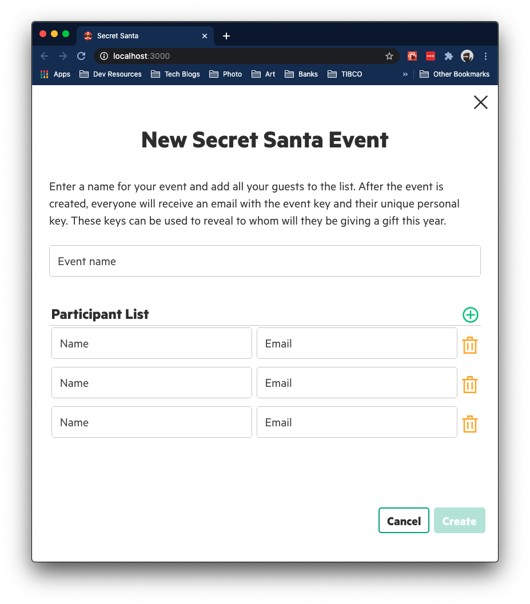
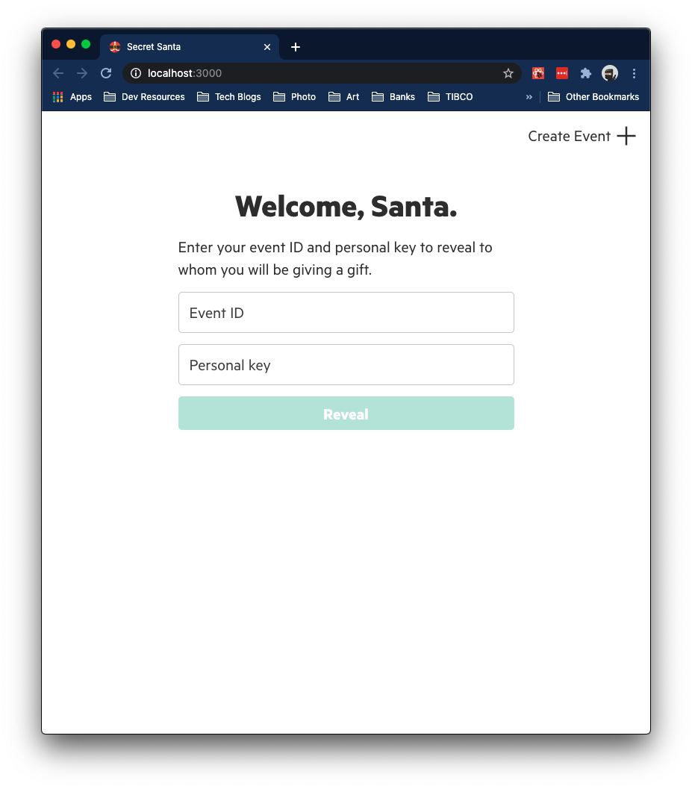

    
    <h3>Secret Santa</h3>
    
<i>A minimalist web application to organize Secret Santa events</i>

## Using the Application

### Create an Event

Creating an event is very simple. You will need to enter a name for your event and add a list of at least three people, using their names and their email addresses. After the event is created, an email will be sent to every person in the list. The email will include the name of the event, the event key, and a unique personal key.

:mega: Don't forget to include yourself in the list! :mega:

### Reveal Match

Use the event ID and the personal key that were provided in the email to reveal to whom you will be giving a gift.

## Developing

To contribute to the application you need to make sure that the following dependencies have been installed:

- [Node](https://nodejs.org/en/)
- [PostgreSQL](https://www.postgresql.org/)
- [Make](https://www.gnu.org/software/make/)

Afterwards, you can clone the repository and `cd` into it. Use the `make` targets to get things going, in the following order:

- `make init`: Installs all needed dependencies.
- `make db-start`: Starts the postgres service.
- `make db-create`: Creates the database and tables (dropping any tables previously created by the app).

And in two different windows:

- `make local-backend`: Starts the backend.
- `make local-frontend`: Starts the frontend.

Any changes made will be picked up automatically for both processes (the Node backend and the React frontend).

## Running the Application in a Container

To run the application in a container we use Docker Compose. You will need to make sure that both Docker Engine and Docker Compose are installed (both are usually installed with an installation of Docker Desktop).

To start the application, use `make docker-start`. To stop it, use `make docker-stop`. To remove the image, use `make docker-clean`.

Note that changes in the code will not be picked up (the image needs to be rebuild).